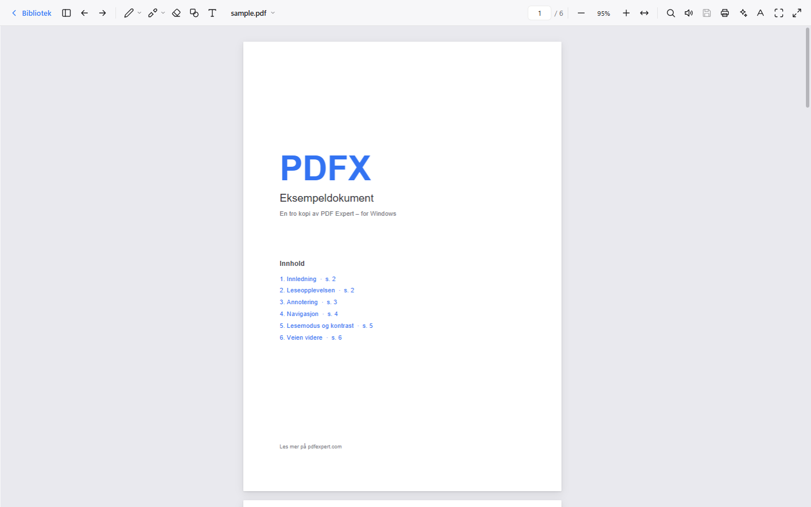
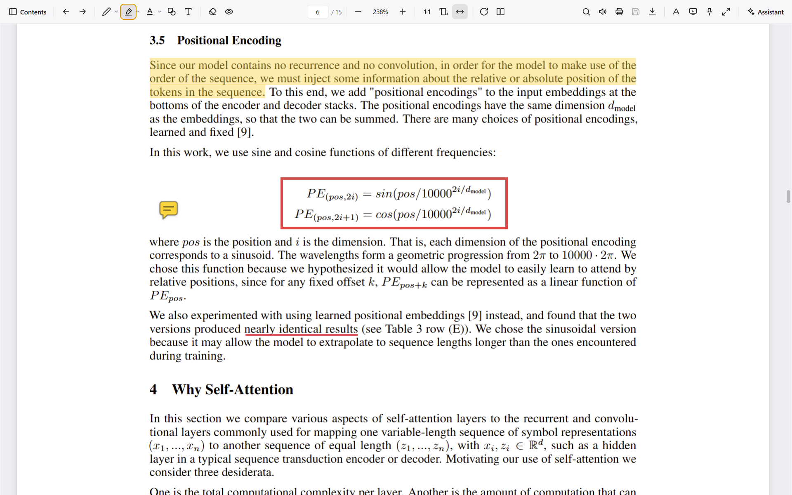
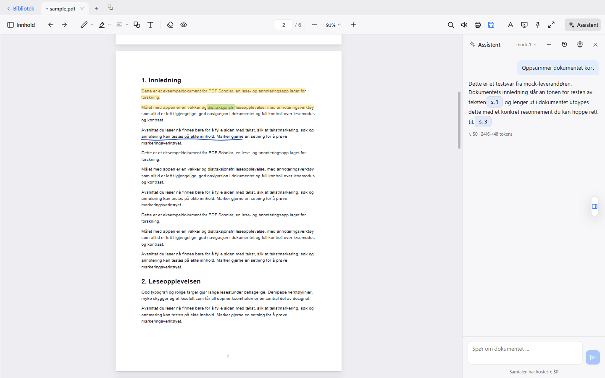
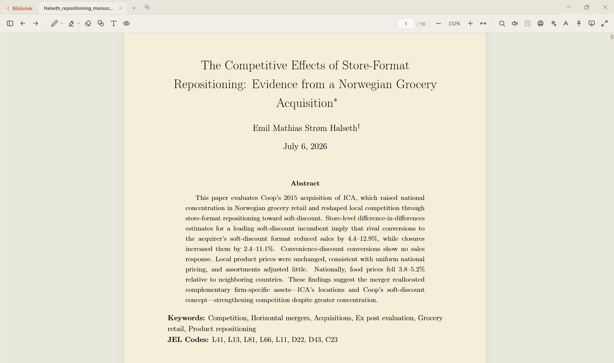
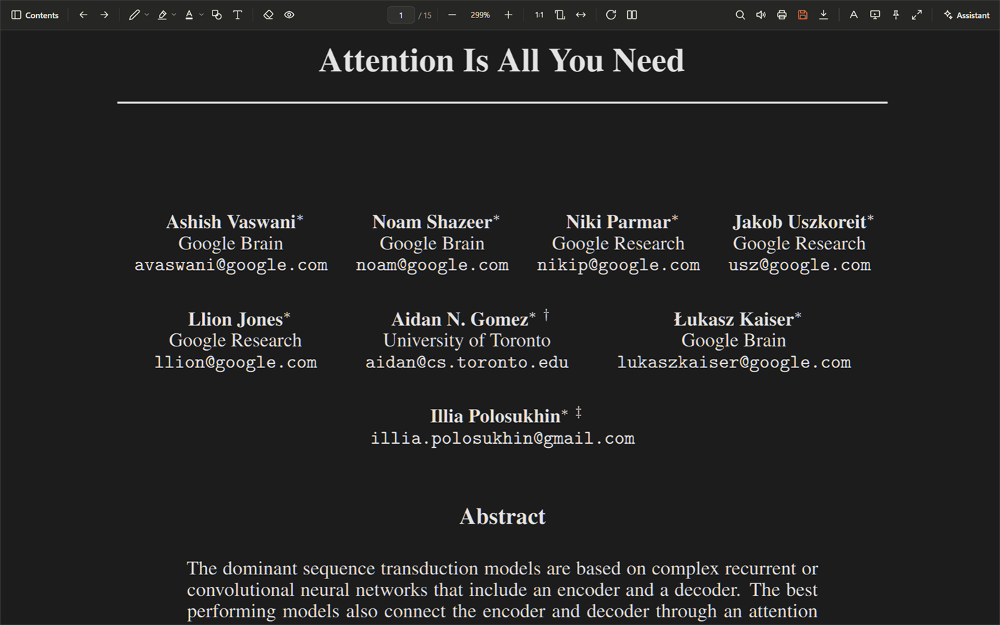

# PDF Scholar

**A calm, reading-first PDF app for Windows — built for people who work with texts.**

PDF Scholar is a PDF reader and annotator for Windows — with beta builds for macOS
and Linux — made for people who *read to work*: research articles, reports, books.
Reading comes first — the annotation tools stay within reach, the AI help stays
grounded in the document, and nothing gets between you and the page.



## Download

There are two ways to run PDF Scholar — a native desktop app, or a browser extension
that takes over PDFs inside Edge/Chrome. They share the same reader, annotator and
assistant, so you can pick whichever fits how you already open documents.

### Desktop app (Windows)

[](https://github.com/emilmsh/pdf-scholar/releases/latest)

**[⬇ Get PDF Scholar for Windows](https://github.com/emilmsh/pdf-scholar/releases/latest)** —
download `PDF-Scholar-Setup-*.exe` from the latest release and run it. It's a per-user
install (no admin rights), sets up in seconds, opens PDFs straight from Explorer and
adds a "Recent" Jump List to the taskbar. The installer carries both **x64 and native
arm64** builds and picks the right one for your machine (Surface and other
Windows-on-ARM devices get the native version — no emulation). Everything works
offline; add your own Anthropic or OpenAI key in the assistant settings if you want
the AI features.

### Desktop app (macOS) — beta

Download the `.dmg` from the
[latest release](https://github.com/emilmsh/pdf-scholar/releases/latest) — the
**`-arm64`** build for Apple Silicon (M1 and later), the **`-x64`** build for older
Intel Macs. PDF Scholar is free and open source, and **not signed with an
Apple Developer certificate** — macOS will claim the app is "damaged" or from an
unverified developer on first launch. It isn't; that's Gatekeeper's default for any
app distributed outside the App Store without Apple's paid program. To open it:

1. Drag **PDF Scholar.app** from the disk image into **Applications** (don't try to
   open it from inside the disk image).
2. In Terminal, run: `xattr -cr "/Applications/PDF Scholar.app"` — then open the app
   normally.

If the dialog says the app is from an *unverified developer* (rather than
"damaged"), you can instead click **Open Anyway** under **System Settings →
Privacy & Security**. When the message says **"damaged"**, that button never
appears — the Terminal command above is the only route.

Because the app is unsigned, macOS builds also have **no auto-update** — grab new
versions from the releases page.

> **The macOS build hasn't yet been tested on real Apple hardware.** It builds
> cleanly in CI, but the developer works on Windows — so if you run it on a Mac,
> feedback (what works, what looks off, what breaks) is genuinely appreciated:
> please [open an issue](https://github.com/emilmsh/pdf-scholar/issues).

### Desktop app (Linux) — beta

From the [latest release](https://github.com/emilmsh/pdf-scholar/releases/latest):

- **Ubuntu/Debian:** install the `.deb` (recommended — it registers the PDF file
  association, and Ubuntu 24.04+'s AppArmor policy blocks parts of the sandbox for
  AppImages).
- **Other distros:** the `.AppImage` runs anywhere — `chmod +x` and go. No libfuse2
  needed.

Both auto-update in place when a new release is published.

### Browser extension (Edge / Chrome) — beta

The same viewer, but each PDF opens as an ordinary browser tab instead of the
browser's built-in reader. Make your browser the default PDF app and double-clicking a
PDF in Explorer opens it in PDF Scholar too.

[](https://github.com/emilmsh/pdf-scholar/releases/latest/download/pdf-scholar-extension.zip)

**[⬇ Download the extension](https://github.com/emilmsh/pdf-scholar/releases/latest/download/pdf-scholar-extension.zip)** —
no build step needed:

1. Download `pdf-scholar-extension.zip` and unzip it anywhere — it unpacks to a
   single `pdf-scholar-extension` folder.
2. Open `edge://extensions` or `chrome://extensions` and turn on **Developer mode**.
3. **Load unpacked** → select the `pdf-scholar-extension` folder.
4. For local files (the Explorer double-click case): open the extension's **Details**
   and enable **Allow access to file URLs** — a one-time toggle only you can grant.

The extension is **not on the Chrome Web Store / Edge Add-ons yet** — publishing
there takes a developer account and a review pass per store, and browsers
deliberately block one-click installs from anywhere else. Until the store
listings land, the four steps above are as easy as it gets.

See [`docs/BROWSER-EXTENSION.md`](docs/BROWSER-EXTENSION.md) for the architecture and
the current desktop-vs-extension parity.

## Features

**Reading**
- Buttery-smooth scrolling, pinch zoom that never jumps on release, fit width/page (F)
- Day / Sepia / Night / Night+ themes — a warm ivory reading mode and two dark modes
  (soft and high-contrast) — plus **Auto**, which follows Windows' light/dark setting
- Per-theme contrast and brightness so any mode reads comfortably for long sessions
- **Rotate pages** (Shift+R or `]` / `[`) and a **two-page spread** for wide layouts
- **Presentation mode** (P): one page at a time, full screen
- Clean-reading layout: unpin the toolbar (V) and it tucks away; hover the top edge to
  bring it back, the left edge for the table of contents, the right edge for the
  assistant
- Table of contents, thumbnails, and back/forward navigation (Alt+← / Alt+→) after
  following internal links
- **Read aloud** (R): sentence-by-sentence speech with the highlight following along,
  auto-detected Norwegian/English voice and speed control
- Remembers your reading position and recent files; a **library** home screen collects
  what you've been reading
- Tabs for several open documents, plus multiple windows — and you can **drag a tab out
  into its own window** to put two documents side by side

**Annotation**



- Highlight, underline, strikeout, squiggly — with labeled color rows and custom hex
  colors
- Pen and marker with hold-to-straighten (hold still mid-stroke to snap a straight line)
- Eraser that removes whole strokes, shapes (rectangle, ellipse, line, arrow), draggable
  sticky notes, and free text typed directly on the page
- Click any annotation to select it and drag to move; full undo/redo (Ctrl+Z /
  Ctrl+Shift+Z); add a comment to any annotation
- **Real PDF annotations** written with appearance streams — they open correctly in
  Acrobat, SumatraPDF and other viewers
- **You decide when to save**: edits go to a draft, and the file is only touched when
  you hit Save (Ctrl+S). Closing prompts you, and unsaved work survives a crash
- **Notes tab**: every annotation grouped by page with search and a color filter;
  export a summary — including the highlighted text itself — to Markdown, HTML or plain
  text

**Search & the web**
- In-document search (Ctrl+F): match case, whole word (Norwegian æøå-safe), a results
  list with excerpts, jump-to-hit, F3 / Shift+F3
- **Web search in a side panel** — look something up without leaving the document
- Selection menu: copy, search the web, dictionary, translate, and the AI actions below

**AI assistant (bring your own key)**



Stuck on a dense passage? Ask the assistant to explain it in plain terms — the answer
is grounded in the document, with clickable source chips that take you straight to the
sentences it drew from.

- Understand hard passages in plain language — ask "explain this simply" or "what does
  this term mean here?" and every claim comes with a clickable source chip ("s. 12")
  that jumps to and highlights the exact passage, down to sentence level
- Structured article summaries (research question / method / data / findings /
  limitations)
- Ask your own annotations: "summarize what I've highlighted"
- Explain / simplify / define selected text, and look up a cited reference, from the
  context menu
- Providers: Anthropic (Claude, with native citations), OpenAI and Azure OpenAI, with
  per-model reasoning-effort control. Keys are encrypted locally with the Windows
  keychain, and the document leaves your machine only when you ask a question
- Cost transparency: every answer shows its estimated cost

**Scholarly by design**



Norwegian and English UI throughout — the language also drives the AI prompts, export
documents and date formats. The Sepia theme brings a warm ivory reading mood with a
terracotta accent, calm on the eyes for long sessions — and the two night modes keep
late reading easy on the eyes.



## Development

```bash
npm install
npm run dev        # full Electron app with HMR
npm run dev:web    # renderer only, in a plain browser on :5199
npm run typecheck  # tsc for renderer + main/preload
npm run dist       # NSIS installer (Windows)
npm run build:ext  # browser-extension bundle → dist-extension/
```

Architecture in short: **pdf.js v6 renders, EmbedPDF (PDFium WASM) writes.** The React renderer
draws annotations in its own overlay (never pdf.js's editor layer); the Electron main
process owns the annotation engine, the AI providers and the draft-based save model.
The renderer is platform-agnostic — every platform call goes through one interface
(`PdfxApi`), so the same UI powers the desktop app, the browser extension and the
plain-browser dev preview. See `CLAUDE.md` and `ROADMAP.md` for the details and the
road ahead.

## Status

Personal project under active development. Installers are attached to the
[GitHub releases](https://github.com/emilmsh/pdf-scholar/releases).

## Citing

If PDF Scholar was useful in your research workflow, a citation is appreciated —
use GitHub's **Cite this repository** button, backed by [`CITATION.cff`](CITATION.cff).

## License

PDF Scholar is licensed under the **[MIT License](LICENSE)**. Every bundled
component is permissively licensed: annotations are written by
[EmbedPDF](https://www.embedpdf.com/)'s PDFium build (MIT / BSD-3-Clause),
rendering by [pdf.js](https://mozilla.github.io/pdf.js/) (Apache-2.0), plus
[Electron](https://www.electronjs.org/) (MIT), [React](https://react.dev/) (MIT) and the
[Anthropic SDK](https://github.com/anthropics/anthropic-sdk-typescript) (MIT).
([mupdf](https://mupdf.com/), AGPL, is used only as a development-time test
verifier and ships with no release build.)
