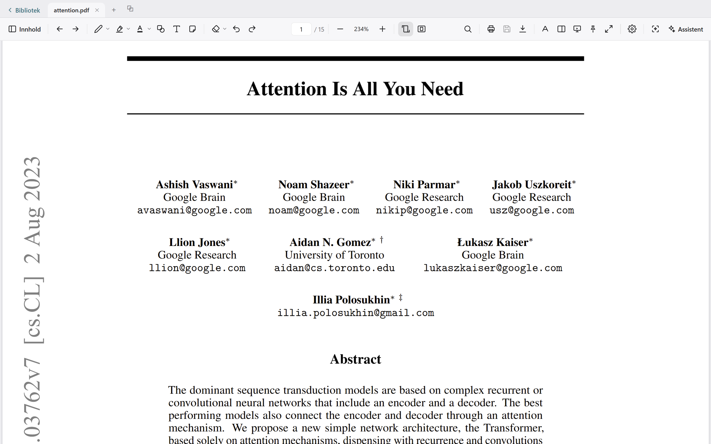
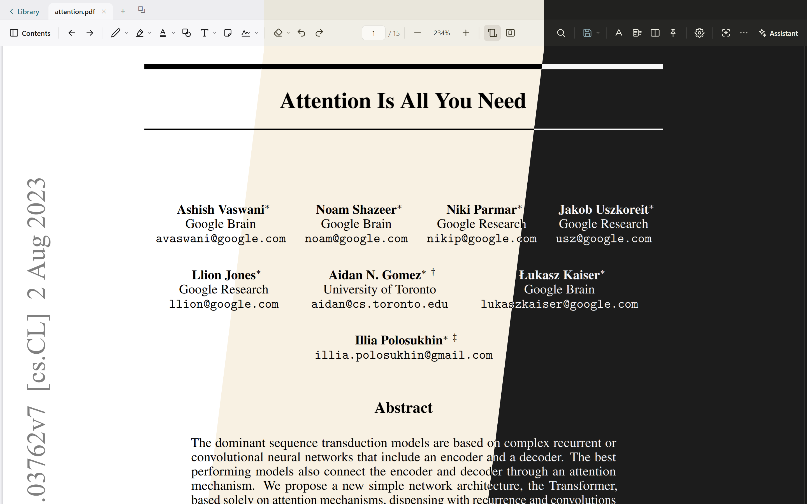
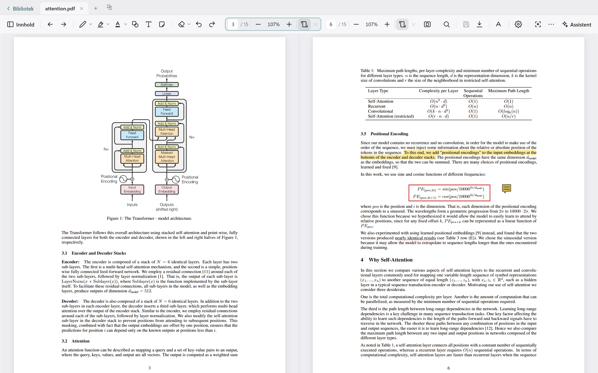
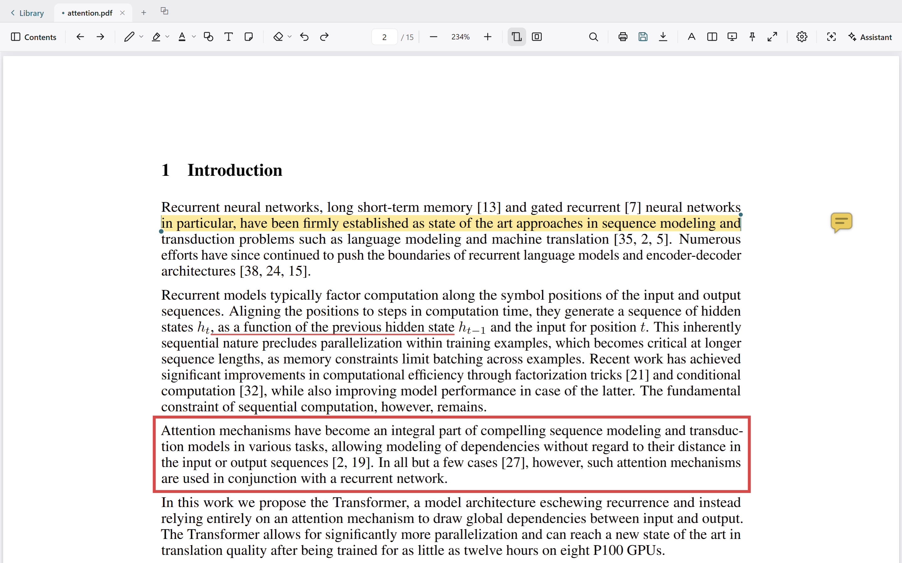
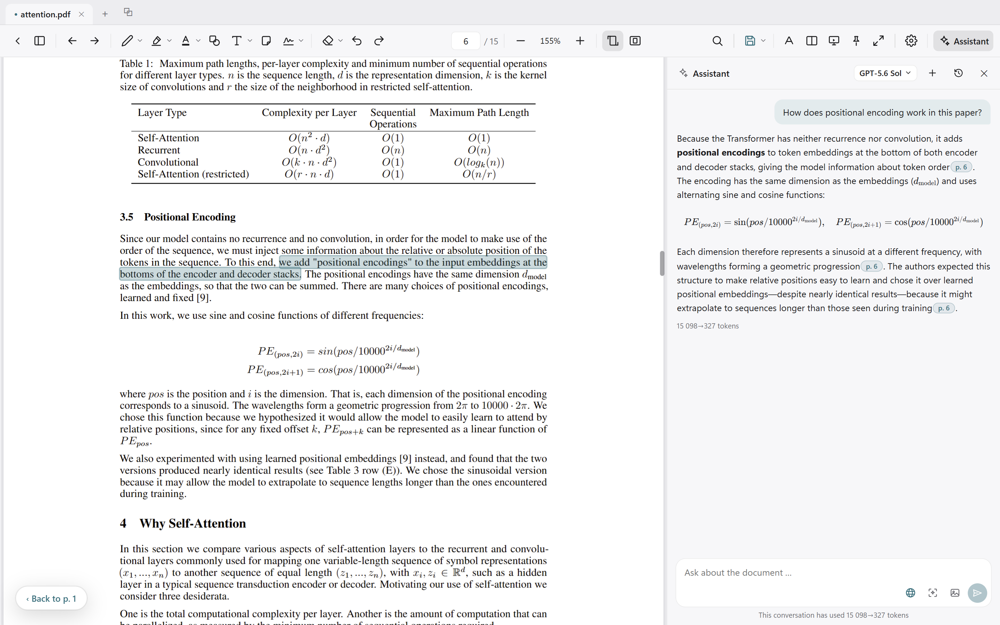
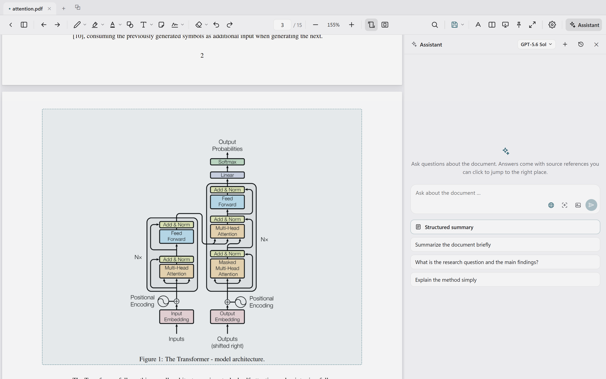
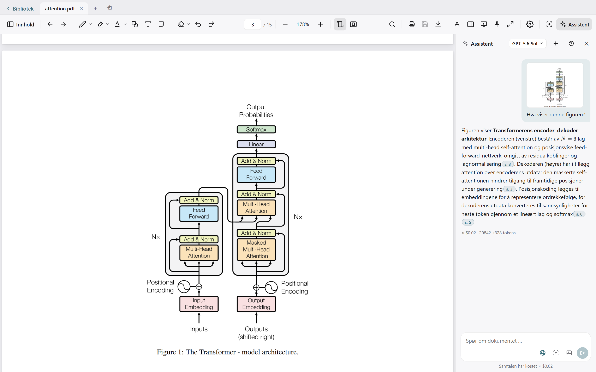

<p align="center">
  
</p>

<h1 align="center">PDF Scholar</h1>

<p align="center"><strong>A Windows PDF reader built for reading.</strong></p>

PDF Scholar is for the documents you work through rather than skim: research articles,
reports, books. The window is nearly all page: one slim toolbar carries the tools you use
frequently, the contents and assistant panels stay out of the way until you call them, and 
toggling fullscreen or the toolbar is always one click away, leaving the page and nothing else.

Everything a long document asks of you is here. A page you can stand to look at all day, in
light, sepia or dark mode. Highlight, pen, shapes and notes, each with its own colour, thickness
and opacity, remembered between sessions — the menu comes to the text you selected, and every
mark you make stays one panel away. A second reading pane, so a figure or table can sit beside the
passage that discusses it. Cross-references you can go to and return from, which is the
difference between reading a paper and losing your place in one. And an optional AI-assistant
that answers from the document, cites the sentence it used, explains snapshots of figures and images, 
and finds the passage you half-remember. Free, MIT-licensed, and offline unless you
ask a question.

Windows is the reference build; macOS and Linux are in beta, and a browser extension puts
the same reader inside your browser.



## Download

There are two ways to run PDF Scholar: a native desktop app, or a browser extension that
takes over PDFs inside Edge/Chrome. Both use the same reader, annotator and assistant.

### Desktop app (Windows)

[](https://github.com/emilmsh/pdf-scholar/releases/latest)

**[⬇ Get PDF Scholar for Windows](https://github.com/emilmsh/pdf-scholar/releases/latest)** —
download `PDF-Scholar-Setup-*.exe` from the latest release and run it. It is a per-user
install, so it needs no admin rights. It registers as a PDF handler in Explorer and adds
a "Recent" Jump List to the taskbar. The installer contains both **x64 and native arm64**
builds and picks the right one, so Windows-on-ARM machines (Surface and similar) run the
arm64 build rather than x64 under emulation. Everything works offline. The AI features
need your own API key (Anthropic, OpenAI or Azure OpenAI), entered in the assistant
settings.

[](https://apps.microsoft.com/detail/9N75CPC0G9M2)

**[⬇ Get PDF Scholar from the Microsoft Store](https://apps.microsoft.com/detail/9N75CPC0G9M2)** —
the same app as an MSIX package, x64 and arm64, although the installer is updated more frequently. 

### Desktop app (macOS) — beta

The build is **not signed with an Apple Developer certificate** (deliberate —
the app has zero recurring costs), which shapes both paths below the same way:
Gatekeeper needs one `xattr` command per installed version, and the app cannot
update itself.

**With [Homebrew](https://brew.sh)** — recommended, because `brew upgrade`
then delivers new versions:

```sh
brew install --cask emilmsh/tap/pdf-scholar
xattr -cr "/Applications/PDF Scholar.app"
```

The second line is the Gatekeeper step — repeat it after each `brew upgrade`.

**By hand:** download the `.dmg` from the
[latest release](https://github.com/emilmsh/pdf-scholar/releases/latest) —
**`-arm64`** for Apple Silicon (M1 and later), **`-x64`** for Intel Macs. Drag
**PDF Scholar.app** into **Applications** (not straight from the disk image),
run the same `xattr` command, and open the app normally. New versions come
from the releases page.

If Gatekeeper's dialog says *unverified developer* rather than "damaged",
**Open Anyway** under **System Settings → Privacy & Security** works as well;
the "damaged" variant never offers that button, so use the Terminal command.

> **The macOS build has not been tested on Apple hardware yet** — it is built in
> CI. If you run it on a Mac, [open an
> issue](https://github.com/emilmsh/pdf-scholar/issues) with what works and what
> breaks.

### Desktop app (Linux) — beta

From the [latest release](https://github.com/emilmsh/pdf-scholar/releases/latest):

- **Ubuntu/Debian:** install the `.deb` (recommended — it registers the PDF file
  association, and Ubuntu 24.04+'s AppArmor policy blocks parts of the sandbox for
  AppImages).
- **Other distros:** the `.AppImage` runs anywhere — `chmod +x` and go. No libfuse2
  needed.

Both auto-update in place when a new release is published.

### Browser extension (Edge / Chrome) — beta

The same viewer, but each PDF opens as an ordinary browser tab instead of in the
browser's built-in reader. Make your browser the default PDF app and double-clicking a
PDF in Explorer opens it here too.

[](https://github.com/emilmsh/pdf-scholar/releases/latest/download/pdf-scholar-extension.zip)

**[⬇ Download the extension](https://github.com/emilmsh/pdf-scholar/releases/latest/download/pdf-scholar-extension.zip)** —
no build step needed:

1. Download `pdf-scholar-extension.zip` and unzip it anywhere — it unpacks to a
   single `pdf-scholar-extension` folder.
2. Open `edge://extensions` or `chrome://extensions` and turn on **Developer mode**.
3. **Load unpacked** → select the `pdf-scholar-extension` folder.
4. For local files (the Explorer double-click case): open the extension's **Details**
   and enable **Allow access to file URLs** — a one-time toggle only you can grant.

The extension is **not on the Chrome Web Store / Edge Add-ons yet**, and browsers only
allow one-click installs from those stores — so the four steps above are the way in until
the listings are live.

See [`docs/BROWSER-EXTENSION.md`](docs/BROWSER-EXTENSION.md) for the architecture and
the current desktop-vs-extension parity.

## Features

**Reading**
- Smooth scrolling, pinch zoom that stays where you release it, one fit button that
  toggles width ⇄ whole page (W), and zoom presets from 50 % to 400 %. Fit uses the whole
  window: the page goes edge to edge, with a hair of margin
- Four themes — Day, Sepia (ivory paper), Night and Night+ (higher contrast) — plus
  **Auto**, which follows Windows' light/dark setting
- Contrast and brightness are adjustable per theme
- **Rotate pages** (Shift+R or `]` / `[`) and a **two-page spread** for wide layouts
- **Presentation mode** (P): one page at a time, full screen
- Unpin the toolbar (V) and it hides. Hover the top edge to bring it back, the left edge
  for the table of contents, the right edge for the assistant
- Table of contents, thumbnails, bookmarks (B marks the page you are on), and back/forward
  navigation (Alt+← / Alt+→) after following internal links
- Remembers your reading position and recent files; a **library** home screen lists what
  you have been reading
- Tabs for several open documents, plus multiple windows. **Drag a tab out into its own
  window** to put two documents side by side, or across the bar to reorder

**Language and themes**



Above: the same page in Day, Sepia and Night, in one frame. Sepia puts the page on warm
ivory with a terracotta accent; Night and Night+ are the two dark modes, the second with
higher contrast for bright text on very dark grey. The interface itself is available in
Norwegian and English, and the setting also controls the AI prompts, exported documents
and date formats.

**Split view**



Research papers and reports often ask you to hold two pages in your head at the same
time — for example, a table or figure on one, the relevant text somewhere else. Press
**S** and you get both.

- **Two columns of the same document**, each with its own page and its own zoom. Keep a
  figure or a table in view while you read the passage that discusses it
- Both columns are equals. The toolbar's centre gains a column switcher showing both
  columns' page numbers — the active one solid — and its page + zoom controls drive that
  column; click the other number (or the column itself) to move over. You can annotate,
  erase and undo in either one; it is a single document, so a mark shows up in both
  columns as you make it
- **Rotation is per column**, so a landscape-printed table can sit upright beside
  portrait text
- **Ctrl+click an internal link to open the target in the other column**, keeping the
  page you are on. It opens the split first if it is closed. A plain click follows the
  link in place. External links always open in your browser, where the modifier does
  nothing
- Search, the outline, the notes list and the assistant's citation chips all move the
  active column and leave the other alone. Back/forward history is per column as well
- Drag the divider to rebalance (double-click it for an even split); both columns re-fit
  as you drag. Opening the contents or assistant panel narrows both columns in proportion,
  so the balance you set survives it. The ✕ beside the zoom closes the active column and
  keeps the other's content
- **S remembers the column you closed** — its page, the exact spot on it, its zoom, its
  rotation and the width you gave it. Park a figure on the right, toggle it away to read
  in peace, toggle it back: it returns framed exactly as you left it. Closing the *left*
  column instead moves the right one's view over, and starts the next split fresh
- **Two windows on the same file also work**: they share one draft and sync as you
  annotate, and a Save from either window writes each mark exactly once

**Annotation**



Marking up a paper should not interrupt reading it. The tools come to the text you
selected, what you have marked is one panel away, and neither the tools nor the marks
clutter the page while you read.

- **Select text and the menu comes to you**: highlight, underline, strikeout and squiggly
  in one row each, a comment or a note, copy, dictionary, translate — and the assistant's
  actions on exactly what you selected. The toolbar carries the same tools for when you
  want to mark several passages in a row, and unpins entirely (V) when you want nothing
  but the page
- **Notes tab**: every annotation grouped by page, with search and a colour filter, and a
  click takes you to the mark. Export a summary — including the highlighted text itself —
  to Word, Markdown, HTML or plain text. Clearing them all is one confirmed step, and one
  Ctrl+Z brings the lot back
- Labeled colour rows and custom hex colours
- Pen and marker with hold-to-straighten: hold still mid-stroke and the line snaps
  straight
- **Colour, thickness and opacity per tool**, remembered between sessions. A «Standard»
  link appears next to any tool you have changed from its default
- Shapes (rectangle, ellipse, line, arrow), draggable sticky notes, and free text typed
  directly on the page
- An eraser that removes whole strokes, and can be set to remove every kind of
  annotation instead
- Click any annotation to select it, drag to move it, and add a comment to it. Full
  undo/redo (Ctrl+Z / Ctrl+Shift+Z)
- Selected marks can be adjusted rather than redrawn: drag either end of a highlight to
  cover more or less text (it snaps to whole words), or a corner of a shape, text box or
  drawing to resize it
- Comment and note bubbles can be dragged **and resized** — pull the corner for a long
  note, double-click the grip to restore the default size
- **The selection menu drags aside too**, by the grip along its top: it is the tallest
  popup in the app, and seeing what is under it should not cost you the selection
- **The file is only written when you save it.** Edits go to a draft until you press
  Save (Ctrl+S); closing prompts you, and unsaved work survives a crash. What lands in
  the file is standard PDF annotations with appearance streams, so it reads the same in
  Acrobat, SumatraPDF and anywhere else it goes
- Preferences reset to their defaults, per tool or all at once from the settings menu
  (with a confirmation; API keys, library and annotations are left untouched)

**Search & the web**
- In-document search (Ctrl+F): match case, whole word (Norwegian æøå-safe), a results
  list with excerpts, jump-to-hit, F3 / Shift+F3. Every match on the page is marked
  quietly while you search, with the one you are on kept loud, and the last ten searches
  are offered when the field is empty
- **AI search**: describe a topic in your own words and get the passages that discuss it,
  ranked and clickable (uses your own API key, like the assistant)
- Selection menu: copy, search the web, dictionary, translate, and the AI actions below

**AI assistant (bring your own key)**



The assistant answers from the document you have open, and every claim it makes carries a
source chip. Click one and you land on the sentence the claim came from, so you can check
the answer rather than take it on trust.

- Ask about a dense passage ("explain this simply", "what does this term mean here?").
  The chip reads as a page number ("s. 12"), the jump highlights the sentence itself, as
  in the picture above, and getting back is one click on the pill in the corner
- Structured article summaries (research question / method / data / findings /
  limitations)
- Ask about your own annotations: "summarize what I've highlighted"
- Context-menu actions on any selection: explain, simplify, critique ("what would a
  referee ask?"), look up a cited reference, find similar passages, or ask your own
  question
- **Explain a figure**: drag a box around a chart, diagram or table and the region lands
  in the chat as an attachment you can add a question to — nothing is sent until you do.
  The answer describes what is actually in the crop, and cites the pages it draws on. You
  can paste or attach images the same way
- **Scanned documents**: a PDF that is pictures of words has no text to search, and the
  assistant says so instead of answering about nothing. Pick a page range and those pages
  are attached as images for it to read — the chip names which ones, and it is told it can
  see only those
- **Optional web search**, off by default: closed, on request, or always on (Anthropic
  and OpenAI keys). LaTeX in answers renders properly, so maths stays readable
- Providers: Anthropic (Claude, with native citations), OpenAI and Azure OpenAI — one
  model list across all three, with per-model reasoning-effort control. Your key goes to
  the provider you picked and nowhere else — there is no server of ours in between — and
  the document leaves your machine only when you ask a question
- **Cost stays visible**: each answer shows the tokens the provider counted, and the key
  settings link straight to your provider's console, where you set a spending cap and see
  what you have spent





**Where your key is kept**

You paste the key once, in the assistant's settings, and it goes into the platform's key
store: DPAPI on Windows, Keychain on macOS, the system keyring on Linux. The browser
extension has no key store to reach, and encrypts the key under a key no script can read
out instead. The settings panel names the case that applies on your machine, and
[docs/PRIVACY.md](docs/PRIVACY.md) has the per-platform detail. A spending cap in the
provider's console is worth setting either way: no local storage can stop a program that
is already running as you from asking for the key to be decrypted.

## Development

```bash
npm install
npm run dev        # full Electron app with HMR
npm run dev:web    # renderer only, in a plain browser on :5199
npm run typecheck  # tsc for renderer, main/preload and the extension
npm run dist       # NSIS installer (Windows)
npm run build:ext  # browser-extension bundle → dist-extension/
npm run test:windows  # two windows on one file, end to end (needs npm run build first)
npm run shoot         # drive the app into each documented state and photograph it
npm run check:shots   # which shipped screenshots predate the visual changes
```

`npm run shoot` and `npm run test:windows` drive the real desktop app over Chromium's
DevTools protocol, which Electron already ships, so neither needs a browser-automation
dependency. Both run in a throwaway profile that starts from factory defaults and leaves
your recents, reading positions and theme alone.

Every shot asserts the state before capturing, so a renamed tooltip or a jump that never
happened fails the run instead of saving a wrong picture — `shoot` is a UI smoke test as
much as a camera. `--list` shows the shot names; pass names to run a subset. The assistant
shots replay an answer recorded once into `docs/ai-fixtures/`, so an ordinary run needs no
API key and costs nothing; only the provider call comes from disk, while the chips, the jump
to the cited sentence, the highlight and the snipped region all run live. `--with-ai` calls
the real provider with your own key, and `--record` refreshes the recording.

Shots land in the gitignored `docs/screenshots/_auto/`; the images in this README are
picked by hand. `npm run check:shots` reports which shipped images predate the visual
changes since — see [`docs/RELEASE.md`](docs/RELEASE.md).

`npm run test:windows` opens a second window on the same file, annotates in both, saves
from one, and verifies the result with mupdf — a different PDF implementation, so it cannot
share a bug with our writer. It covers the whole path at once: the overlay, the IPC, main's
shared draft, the reload in the other window, and the bytes on disk.

Architecture in short: **pdf.js v6 renders, EmbedPDF (PDFium WASM) writes.** The React
renderer draws annotations in its own overlay, never pdf.js's editor layer. The Electron
main process owns the annotation engine, the AI providers and the draft-based save model.
Every platform call goes through one interface (`PdfxApi`), so the same renderer powers the
desktop app, the browser extension and the plain-browser dev preview. See `CLAUDE.md` and
`docs/ROADMAP.md` for the details and the road ahead.

## Status

Actively developed, by someone who reads PDFs for a living. Installers are attached to the
[GitHub releases](https://github.com/emilmsh/pdf-scholar/releases), and
[`docs/PLATFORMS.md`](docs/PLATFORMS.md) lists what each platform supports today.

## Citing

If PDF Scholar was useful in your research workflow, a citation is appreciated —
use GitHub's **Cite this repository** button, backed by [`CITATION.cff`](CITATION.cff).

## License

PDF Scholar is licensed under the **[MIT License](LICENSE)**. Every bundled
component is permissively licensed: annotations are written by
[EmbedPDF](https://www.embedpdf.com/)'s PDFium build (MIT / BSD-3-Clause),
rendering by [pdf.js](https://mozilla.github.io/pdf.js/) (Apache-2.0), plus
[Electron](https://www.electronjs.org/) (MIT), [React](https://react.dev/) (MIT), the
[Anthropic SDK](https://github.com/anthropics/anthropic-sdk-typescript) (MIT) and the
[Libertinus](https://github.com/alerque/libertinus) wordmark font (SIL OFL 1.1).
([mupdf](https://mupdf.com/), AGPL, is used only as a development-time test
verifier and ships with no release build.)

---

<sub>Logo by Elisabeth Walle.</sub>
