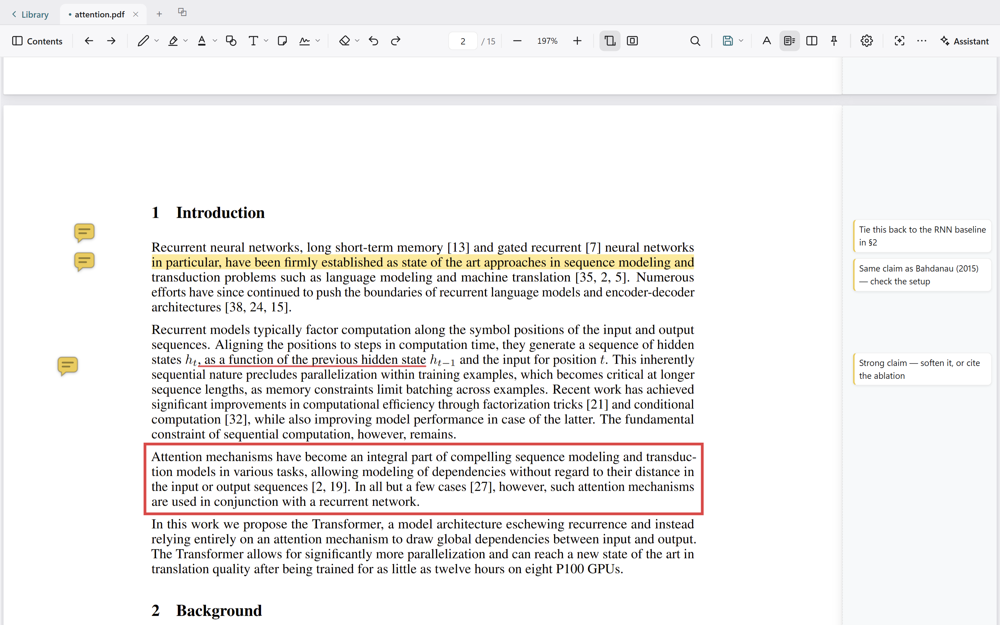
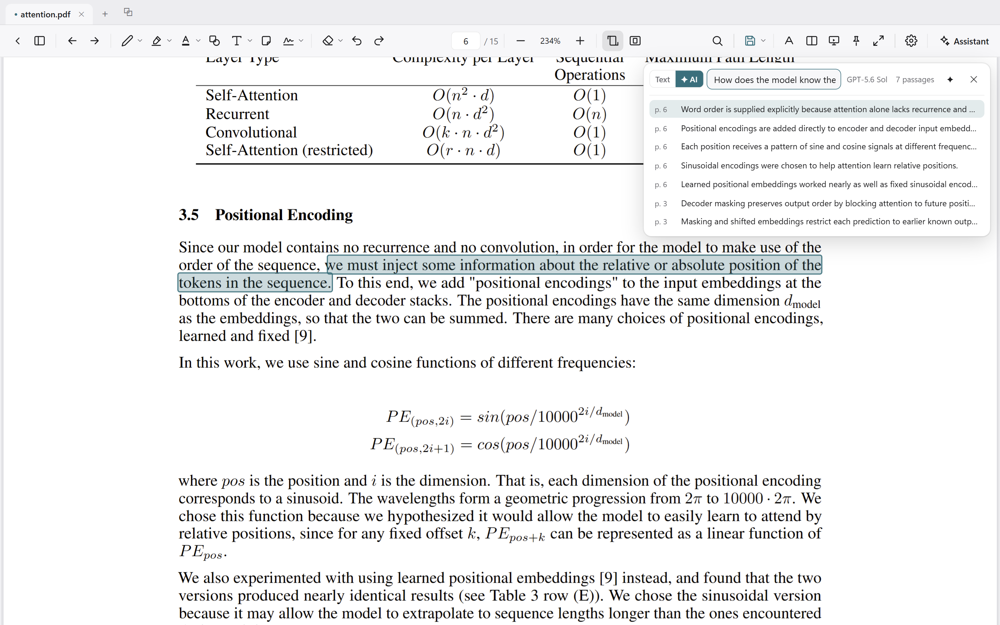
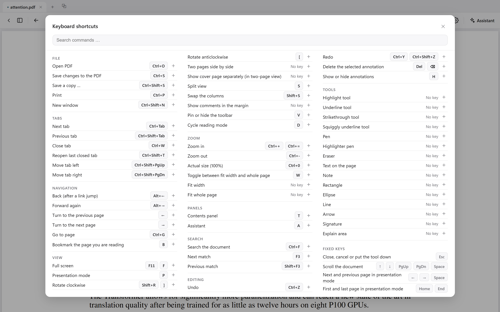

<p align="center">
  
</p>

<h1 align="center">PDF Scholar</h1>

<p align="center"><strong>A PDF reader for research.</strong></p>

PDF Scholar is for the documents you work through rather than skim: research articles,
reports, books. The window is nearly all page — one slim toolbar carries the tools, the
contents and assistant panels stay out of the way until called, and the toolbar itself
can be unpinned, leaving only the page.

There are four reading themes, and every file reopens where you stopped. Annotation
happens from a menu that opens at the selected text; every mark is listed in a panel
beside the document, and comments can be laid out in the margin — or exported into one.
A split view places a figure or table beside the passage that discusses it, and
cross-references can be followed and returned from. The optional AI assistant answers
from the open document and cites the passage each claim came from. Free, MIT-licensed,
and offline unless you ask a question.

PDF Scholar runs on Windows and macOS; a Linux build is in beta, and a browser extension
puts the same reader inside your browser.


## Download

There are two ways to run PDF Scholar: a native desktop app, or a browser extension that
takes over PDFs inside Edge/Chrome. Both use the same reader, annotator and assistant.

### Desktop app (Windows)

[](https://github.com/emilmsh/pdf-scholar/releases/latest)

**[⬇ Get PDF Scholar for Windows](https://github.com/emilmsh/pdf-scholar/releases/latest)** —
download `PDF-Scholar-Setup-*.exe` from the latest release and run it. It is a per-user
install, so it needs no admin rights. It registers as a PDF handler in Explorer and adds
a "Recent" Jump List to the taskbar. The installer contains both **x64 and native arm64**
builds and picks the right one, so Windows-on-ARM machines (Surface and similar) run the
arm64 build rather than x64 under emulation. Everything works offline. The AI features
need your own API key (Anthropic, OpenAI, Azure OpenAI, OpenRouter, Google Gemini,
Grok, Mistral or Groq) — or any OpenAI-compatible endpoint, including local models
via Ollama or LM Studio, which need no key at all — entered in the assistant settings.

[](https://apps.microsoft.com/detail/9N75CPC0G9M2)

**[⬇ Get PDF Scholar from the Microsoft Store](https://apps.microsoft.com/detail/9N75CPC0G9M2)** —
the same app as an MSIX package, x64 and arm64, although the installer is updated more frequently. 

### Desktop app (macOS)

The build is **not signed with an Apple Developer certificate** (deliberate —
the app has zero recurring costs), which shapes both paths below the same way:
Gatekeeper needs one `xattr` command per installed version, and the app cannot
install its own updates. It does still watch for them — when a new version
appears, PDF Scholar says so and hands you the command or the download link,
whichever matches how you installed it.

**With [Homebrew](https://brew.sh)** — recommended, because `brew upgrade`
then delivers new versions:

```sh
brew install --cask emilmsh/tap/pdf-scholar
xattr -cr "/Applications/PDF Scholar.app"
```

The second line is the Gatekeeper step — repeat it after each `brew upgrade`.

**By hand:** download the `.dmg` from the
[latest release](https://github.com/emilmsh/pdf-scholar/releases/latest) —
**`-arm64`** for Apple Silicon (M1 and later), **`-x64`** for Intel Macs. Drag
**PDF Scholar.app** into **Applications** (not straight from the disk image),
run the same `xattr` command, and open the app normally. New versions come
from the releases page.

If Gatekeeper's dialog says *unverified developer* rather than "damaged",
**Open Anyway** under **System Settings → Privacy & Security** works as well;
the "damaged" variant never offers that button, so use the Terminal command.

The build is made in CI on every release and has been tested on Apple hardware.
If something misbehaves on your Mac, [open an
issue](https://github.com/emilmsh/pdf-scholar/issues) with what works and what
breaks.

### Desktop app (Linux) — beta

From the [latest release](https://github.com/emilmsh/pdf-scholar/releases/latest):

- **Ubuntu/Debian:** install the `.deb` (recommended — it registers the PDF file
  association, and Ubuntu 24.04+'s AppArmor policy blocks parts of the sandbox for
  AppImages).
- **Other distros:** the `.AppImage` runs anywhere — `chmod +x` and go. No libfuse2
  needed.

Both auto-update in place when a new release is published.

### Browser extension (Edge / Chrome) — beta

The same viewer, but each PDF opens as an ordinary browser tab instead of in the
browser's built-in reader. Make your browser the default PDF app and double-clicking a
PDF in Explorer opens it here too. It is in both stores:

[](https://microsoftedge.microsoft.com/addons/detail/pdf-scholar/jdmemepojgjhflpeckiiciibnhmbdjcc)
[](https://chromewebstore.google.com/detail/pdf-scholar/jhhlaaiegmdmjeeiopmdmoiidnbbhbmd)

**[⬇ Get it for Edge](https://microsoftedge.microsoft.com/addons/detail/pdf-scholar/jdmemepojgjhflpeckiiciibnhmbdjcc)**
or **[for Chrome](https://chromewebstore.google.com/detail/pdf-scholar/jhhlaaiegmdmjeeiopmdmoiidnbbhbmd)** —
one click, and new versions arrive on their own. Store review takes its time, so a listing
can trail the newest release by a version or two.

**By hand** — to run a build newer than the stores carry:

1. Download
   [`pdf-scholar-extension.zip`](https://github.com/emilmsh/pdf-scholar/releases/latest/download/pdf-scholar-extension.zip)
   and unzip it anywhere — it unpacks to a single `pdf-scholar-extension` folder.
2. Open `edge://extensions` or `chrome://extensions` and turn on **Developer mode**.
3. **Load unpacked** → select the `pdf-scholar-extension` folder.

Either way, opening local files (the Explorer double-click case) needs one more toggle:
**Allow access to file URLs**, on the extension's **Details** page. Only you can grant it,
so the extension asks once and then leaves it alone.

See [`docs/BROWSER-EXTENSION.md`](docs/BROWSER-EXTENSION.md) for the architecture and
the current desktop-vs-extension parity.

## Features

### Undistracted reading

The frame at the top of this page is one window shown in three of the four reading modes —
the same page, the same moment. Tint sets the page on a light paper tone (here the classic
Sepia cream); Night and Night+ are the two dark modes, the second with higher contrast.

- Smooth scrolling; zoom centres on the cursor or pinch point; one button toggles
  fit-width and whole-page (W)
- Four reading modes — Day, Tint, Night and Night+ — plus Auto, which follows the
  system's light/dark setting. Tint is a light paper tone: the classic Sepia cream, or
  gray, green, blue or sand; Night has its own dark tones. The tinted modes take a
  strength slider — tint strength for the light tones, brightness for Night; 100 % is
  the standard look — and the toolbar and panels follow the chosen tone. D cycles the
  modes
- Night can keep pictures in their original colours: figures and photos stay true while
  the page inverts
- Page rotation (Shift+R) and a two-page spread for wide layouts
- Presentation mode (P): one page at a time, full screen
- The toolbar can be unpinned (V); the side panels go with it, and each returns on hover
  at its window edge
- Table of contents, thumbnails and bookmarks (B) in one panel; the toolbar's page
  field jumps straight to a page number
- Internal links and cross-references can be followed and returned from: back/forward
  navigation (Alt+← / Alt+→, or the mouse side-buttons) holds the history
- Reading positions and recent files are remembered; a library home screen lists them.
  Going back to it closes nothing: open documents stay in the tab strip, and returning
  to one restores the page, zoom and panels
- Several documents open in tabs or separate windows; a tab can be dragged out into its
  own window, or along the bar to reorder
- The interface is in Norwegian or English; the choice also applies to the AI prompts,
  exports and date formats

### Two pages at once


A table or figure often sits on one page and the text that discusses it on another. S
opens a second column of the same document. The second column can also hold another
document: drag its tab into the view, pick it under "Open in split view" in the view
menu ("Another file…" for one not yet open), right-click its tab, or drop a PDF on the
column. Two papers can then be read and annotated side by side, and Shift+S trades the
columns' sides.

- Each column has its own page, zoom and rotation, so a landscape-printed table can sit
  upright beside portrait text
- The toolbar's page and zoom controls drive the active column. Annotation, eraser and
  undo work in either column; a mark lands in the document it is made in, and with one
  document open it appears in both columns
- Ctrl+click on an internal link opens its target in the other column, keeping the
  current page. Search, the outline, the notes list and the assistant's citations move
  only the active column, and back/forward history is per column
- The divider can be dragged to rebalance; a closed column's page, zoom and width are
  restored when the split is reopened
- Two windows on the same file are also possible: they share one draft and stay in sync
  as you annotate

### Annotating while you read


The tools appear at the text you select, and everything you have marked is listed in a
panel beside the document.

- Selecting text opens the annotation menu: highlight, underline, strikeout and squiggly,
  a comment or a note, copy, dictionary, translate, and the assistant's actions on the
  selection. The toolbar carries the same tools for marking several passages in a row
- The notes panel lists every annotation by page, with search and colour, type and
  comment filters. Comments are edited directly in the list, and a click goes to the
  mark. A summary — highlighted text included — exports to Word, Markdown or HTML
- Comments in the margin: one switch lays every note and comment out as a visible card
  beside the page — left or right — colour-keyed to its mark, with a leader line to the
  passage it belongs to
- Margin export: a copy of the document with every page widened and the comments set in
  the new margin as ordinary PDF annotations, numbered at their anchors. The original
  file is untouched


- Pen and marker with hold-to-straighten: holding still mid-stroke straightens the line
- Shapes (rectangle, ellipse, line, arrow), draggable sticky notes, and free text typed
  directly on the page, in the colour and size you pick
- On a touch screen with a stylus, the pen draws while a finger scrolls and zooms; pen
  pressure varies the line width *(beta)* and is preserved in the saved file. A toggle
  in the tool menus hands drawing back to the finger
- The text tool uses the PDF's standard typefaces — Helvetica, Times or Courier, bold
  and italic — chosen before typing or changed on an existing box. Nothing is embedded;
  the text remains searchable and renders identically in other readers
- A signature can be drawn once — with a mouse, pen or finger — or uploaded or pasted as
  an image, and stamped where needed. It is stored locally and saved as a standard stamp
  annotation. *Placing a signature is not the same as digitally signing a document.*
  Where a file already carries digital signatures, the app lists them and does not claim
  to verify them
- Password-protected documents open, can be annotated, and are saved with their
  protection intact
- Colour, thickness and opacity are set per tool and remembered between sessions
- An optional name in settings fills the standard PDF author field on new annotations;
  left empty, they stay unsigned
- An eraser removes whole strokes, or can be set to remove any kind of annotation
- Any mark can be selected, moved, commented on, and adjusted rather than redrawn: the
  ends of a highlight (snapping to whole words), or a corner of a shape, text box or
  drawing. Undo and redo cover everything (Ctrl+Z / Ctrl+Shift+Z)
- Edits are held in a draft until you save (Ctrl+S); closing prompts, and the draft
  survives a crash. What is saved is standard PDF annotations with appearance streams,
  which open correctly in other readers. A guard warns before overwriting a file another
  program has changed

### Search by words or by meaning



Both modes live in one search bar, a tab apart.

- By words (Ctrl+F): match case, whole word, a results list with excerpts, and F3 /
  Shift+F3 between hits. Every match on the page is marked while you search
- By meaning: describe a topic in your own words and get the passages that discuss it,
  ranked (uses the assistant's key)
- The selection menu also offers copy, web search, dictionary and translation

### An assistant that cites its sources


Optional, and it runs on your own API key. The assistant answers from the document you
have open, and each claim carries a source reference; following one goes to the sentence
the claim came from.

- Questions about a passage ("explain this simply", "what does this term mean here?"),
  or a structured article summary: research question, method, data, findings,
  limitations
- Questions about your own annotations: "summarize what I've highlighted"
- Context-menu actions on any selection: explain, simplify, critique, look up a cited
  reference, or a free-form question
- Explain a figure: a region dragged around a chart or table lands in the chat as an
  attachment, staged until you press send — the one-click explain action in the
  selection menu is the exception, and sends the crop as soon as it is drawn. Images can
  be pasted or attached the same way
- A scanned PDF has no text layer, and the assistant reports that instead of guessing;
  a page range can be attached as images for it to read
- The assistant can open in its own window — the document keeps the whole screen, or a
  second monitor carries the chat. A citation click still goes to the passage in the
  window showing the document, and raises it
- The answer text has its own size control (80–160 %), from the model menu or
  Ctrl+scroll over the panel — separate from the document's zoom
- Optional web search, off by default: closed, on request, or always on (Anthropic and
  OpenAI keys). LaTeX in answers is rendered
- Providers: Anthropic (Claude, with native citations), OpenAI, Azure OpenAI,
  OpenRouter, Google Gemini, Grok (xAI), Mistral and Groq — one key field each, entered
  once — plus any OpenAI-compatible endpoint and local models via Ollama or LM Studio,
  which need no key. One menu holds every provider's models — a curated, verified
  list each, strongest first, with the provider's full live listing reachable by
  search; requests go directly to the provider, with no server in between
- Each answer reports the token count the provider billed, and the key settings link to
  the provider's console, where a spending cap can be set


### Shortcuts you can rebind

Every command is listed in one map — Settings → Keyboard shortcuts — grouped by task,
with its keys beside it. Any shortcut can be rebound or reset, one key or all at once;
the keys named in this README are the defaults.



### Local by default

Reading, annotating and saving are entirely local; the app runs without network access.
When you do use the assistant, the request goes directly to the provider you chose, under
your key and that provider's terms — there is no intermediary server, and with a local
model (Ollama, LM Studio) even your questions stay on the machine.

An AI action sends content from the document — normally the whole text, an excerpt for
very long documents — and several actions fire on one click. An AI access switch in the
assistant's settings decides how far that goes: "Confirm before sharing" pauses the first
request that takes a document to a provider in a session — naming the model and what is
about to be attached — and lets follow-up questions about the same document pass; a new
document or a new provider asks again. "Off" blocks every AI request in the transport
layer, so a stored key cannot leak content by accident.

You paste the key once, in the assistant's settings, and it goes into the platform's key
store: DPAPI on Windows, Keychain on macOS, the system keyring on Linux. The browser
extension has no key store to reach, and encrypts the key under a key no script can read
out instead. The settings panel names the case that applies on your machine, and
[docs/PRIVACY.md](docs/PRIVACY.md) has the per-platform detail. A spending cap in the
provider's console is worth setting either way: no local storage can stop a program that
is already running as you from asking for the key to be decrypted.

### Working with Zotero

PDF Scholar works as an external reader for [Zotero](https://www.zotero.org/): in
Zotero's settings (General → "Open PDFs using"), choose PDF Scholar, and library PDFs
open here for reading and annotation. Marks you save are standard PDF annotations
written into the file itself, so Zotero's own reader shows them — read-only, with a
lock icon — and its File → "Import Annotations…" converts the highlights and
underlines into native, editable Zotero annotations (text boxes and ink are not
importable on Zotero's side). Importing *moves* them: Zotero strips the annotations
from the PDF file and keeps them in its database from then on — its import dialog
says so. If you keep reading in PDF Scholar, skip the import; the annotations stay
in the file, Zotero's reader still shows them, and with Zotero sync the annotated
file itself follows to your other devices. Import when you want to work with the
annotations inside Zotero — editing them there, or extracting them into a note — and
use Zotero's File → "Export PDF…" if you later need a copy with them re-embedded.

A document that lives in a Zotero library also gets a Zotero section in the save
button's menu: show the item in Zotero, or copy an in-text citation or full reference
(APA). The metadata comes from Zotero's local API on your own machine — enable it once
in Zotero under Settings → Advanced → "Allow other applications on this computer to
communicate with Zotero". Stored attachments are recognised by their path alone, so for
them "Show in Zotero" works even with the API off. Linked attachments (a library kept in
its own folder, ZotFile-style) carry no item key in their path; they are matched by
filename against the library's attachment list through that same local API, so their
Zotero section appears while Zotero is running with the API enabled.

## Development

```bash
npm install
npm run dev        # full Electron app with HMR
npm run dev:web    # renderer only, in a plain browser on :5199
npm run typecheck  # tsc for renderer, main/preload and the extension
npm run dist       # NSIS installer (Windows)
npm run build:ext  # browser-extension bundle → dist-extension/
npm run ext:local  # same build, mirrored into the folder your browser loaded unpacked
npm run test:windows  # two windows on one file, end to end (needs npm run build first)
npm run shoot         # drive the app into each documented state and photograph it
npm run check:shots   # which shipped screenshots predate the visual changes
```

`npm run shoot` and `npm run test:windows` drive the real desktop app over Chromium's
DevTools protocol, which Electron already ships, so neither needs a browser-automation
dependency. Both run in a throwaway profile that starts from factory defaults and leaves
your recents, reading positions and theme alone.

Every shot asserts the state before capturing, so a renamed tooltip or a jump that never
happened fails the run instead of saving a wrong picture — `shoot` is a UI smoke test as
much as a camera. `--list` shows the shot names; pass names to run a subset. The assistant
shots replay an answer recorded once into `docs/ai-fixtures/`, so an ordinary run needs no
API key and costs nothing; only the provider call comes from disk, while the chips, the jump
to the cited sentence, the highlight and the snipped region all run live. `--with-ai` calls
the real provider with your own key, and `--record` refreshes the recording.

Shots land in the gitignored `docs/screenshots/_auto/`; the images in this README are
picked by hand. `npm run check:shots` reports which shipped images predate the visual
changes since — see [`docs/RELEASE.md`](docs/RELEASE.md).

`npm run test:windows` opens a second window on the same file, annotates in both, saves
from one, and verifies the result with mupdf — a different PDF implementation, so it cannot
share a bug with our writer. It covers the whole path at once: the overlay, the IPC, main's
shared draft, the reload in the other window, and the bytes on disk.

Architecture in short: **pdf.js v6 renders, EmbedPDF (PDFium WASM) writes.** The React
renderer draws annotations in its own overlay, never pdf.js's editor layer. The Electron
main process owns the annotation engine, the AI providers and the draft-based save model.
Every platform call goes through one interface (`PdfxApi`), so the same renderer powers the
desktop app, the browser extension and the plain-browser dev preview. See `CLAUDE.md` and
`docs/ROADMAP.md` for the details and the road ahead.

## Status

Actively developed, by someone who reads PDFs for a living. Installers are attached to the
[GitHub releases](https://github.com/emilmsh/pdf-scholar/releases), and
[`docs/PLATFORMS.md`](docs/PLATFORMS.md) lists what each platform supports today.

## Citing

If PDF Scholar was useful in your research workflow, a citation is appreciated —
use GitHub's **Cite this repository** button, backed by [`CITATION.cff`](CITATION.cff).

## License

PDF Scholar is licensed under the **[MIT License](LICENSE)**. Every bundled
component is permissively licensed: annotations are written by
[EmbedPDF](https://www.embedpdf.com/)'s PDFium build (MIT / BSD-3-Clause),
rendering by [pdf.js](https://mozilla.github.io/pdf.js/) (Apache-2.0), plus
[Electron](https://www.electronjs.org/) (MIT), [React](https://react.dev/) (MIT), the
[Anthropic SDK](https://github.com/anthropics/anthropic-sdk-typescript) (MIT) and the
[Libertinus](https://github.com/alerque/libertinus) wordmark font (SIL OFL 1.1).
Text boxes are set in the PDF standard fonts, which every reader already has —
nothing is embedded in the documents you save.
([mupdf](https://mupdf.com/), AGPL, is used only as a development-time test
verifier and ships with no release build.)

---

<sub>Built by [Emil Mathias Strøm Halseth](https://emilmsh.github.io/), who reads
PDFs for a living, with assistance from [Claude Code](https://claude.com/claude-code).
Logo by [Elisabeth Walle](https://www.linkedin.com/in/elisabeth-walle-239028140/).</sub>
