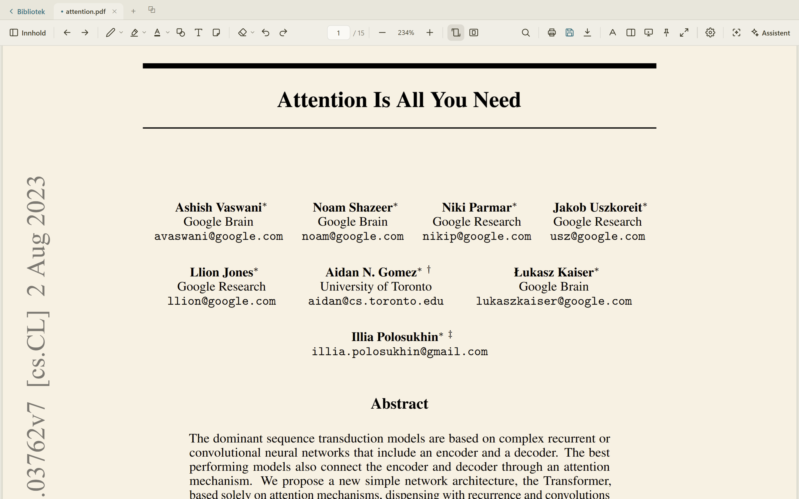
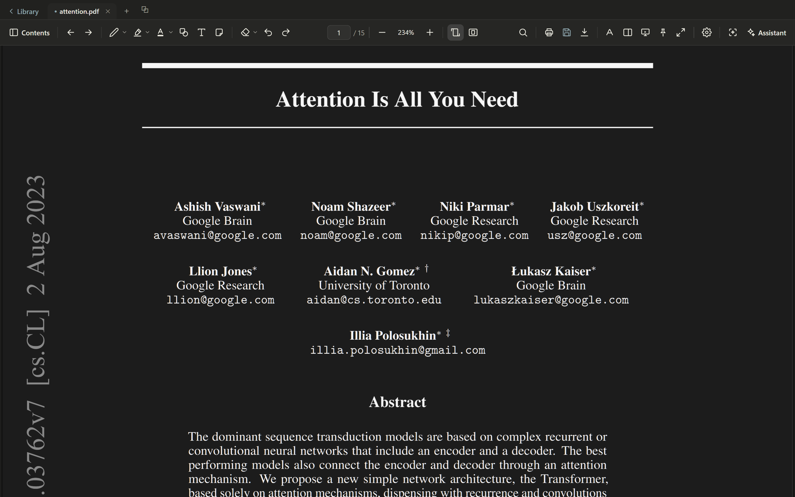
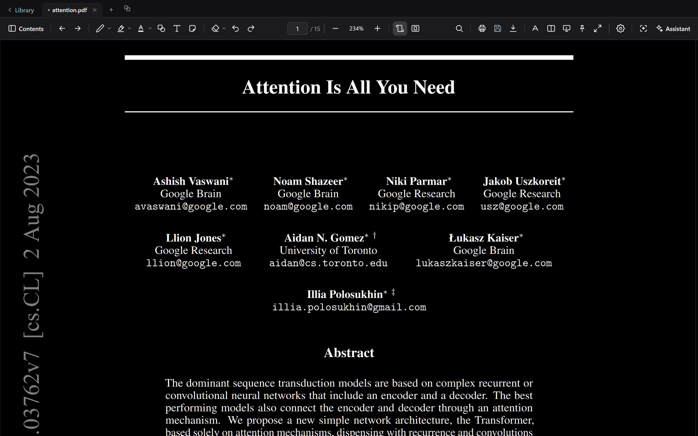

<p align="center">
  
</p>

<h1 align="center">PDF Scholar</h1>

<p align="center"><strong>A Windows PDF reader built for reading.</strong></p>

Windows is not short of PDF apps. What it lacks is one that behaves as though reading the
document were the point. Most bury the page under ribbons for form filling, signing,
conversion and OCR, while the things you do every hour sit two menus deep. PDF Scholar is
reading, learning and annotating first: the page gets the window, the tools you actually
use are one click from it, and everything else stays out of the way until you ask.

That leaves room for what a long document asks of you. A page you can stand to look at all
day, in light, sepia or dark. Highlight, pen, shapes and notes, each with its own colour,
thickness and opacity, remembered between sessions. A second column, so a figure can sit
beside the passage that discusses it. Cross-references you can follow and step back from,
which is the difference between reading a paper and losing your place in one. And an
optional assistant that answers from the document, cites the sentence it used, explains a
figure you drag a box around, and finds the passage you half-remember. Free,
MIT-licensed, and offline unless you ask a question.

Windows is the reference build; macOS and Linux are in beta, and a browser extension puts
the same reader inside your browser.


## Download

There are two ways to run PDF Scholar: a native desktop app, or a browser extension that
takes over PDFs inside Edge/Chrome. Both use the same reader, annotator and assistant.

### Desktop app (Windows)

[](https://github.com/emilmsh/pdf-scholar/releases/latest)

**[⬇ Get PDF Scholar for Windows](https://github.com/emilmsh/pdf-scholar/releases/latest)** —
download `PDF-Scholar-Setup-*.exe` from the latest release and run it. It is a per-user
install, so it needs no admin rights. It registers as a PDF handler in Explorer and adds
a "Recent" Jump List to the taskbar. The installer contains both **x64 and native arm64**
builds and picks the right one, so Windows-on-ARM machines (Surface and similar) run the
arm64 build rather than x64 under emulation. Everything works offline. The AI features
need your own Anthropic or OpenAI key, entered in the assistant settings.

[](https://apps.microsoft.com/detail/9N75CPC0G9M2)

**[⬇ Get PDF Scholar from the Microsoft Store](https://apps.microsoft.com/detail/9N75CPC0G9M2)** —
the same app as an MSIX package, x64 and arm64. Because the Store signs the package on
ingestion, there is no SmartScreen "unknown publisher" warning on first run, and Windows
handles updates. The installer above instead updates itself from GitHub releases; either
route gives you the same app.

### Desktop app (macOS) — beta

Download the `.dmg` from the
[latest release](https://github.com/emilmsh/pdf-scholar/releases/latest) — the
**`-arm64`** build for Apple Silicon (M1 and later), the **`-x64`** build for older
Intel Macs. PDF Scholar is free and open source, and **not signed with an
Apple Developer certificate** — macOS will claim the app is "damaged" or from an
unverified developer on first launch. It isn't; that's Gatekeeper's default for any
app distributed outside the App Store without Apple's paid program. To open it:

1. Drag **PDF Scholar.app** from the disk image into **Applications** (don't try to
   open it from inside the disk image).
2. In Terminal, run: `xattr -cr "/Applications/PDF Scholar.app"` — then open the app
   normally.

If the dialog says the app is from an *unverified developer* (rather than
"damaged"), you can instead click **Open Anyway** under **System Settings →
Privacy & Security**. When the message says **"damaged"**, that button never
appears — the Terminal command above is the only route.

Because the app is unsigned, macOS builds also have **no auto-update** — grab new
versions from the releases page.

> **The macOS build hasn't yet been tested on real Apple hardware.** It builds
> cleanly in CI, but the developer works on Windows — so if you run it on a Mac,
> feedback (what works, what looks off, what breaks) is genuinely appreciated:
> please [open an issue](https://github.com/emilmsh/pdf-scholar/issues).

### Desktop app (Linux) — beta

From the [latest release](https://github.com/emilmsh/pdf-scholar/releases/latest):

- **Ubuntu/Debian:** install the `.deb` (recommended — it registers the PDF file
  association, and Ubuntu 24.04+'s AppArmor policy blocks parts of the sandbox for
  AppImages).
- **Other distros:** the `.AppImage` runs anywhere — `chmod +x` and go. No libfuse2
  needed.

Both auto-update in place when a new release is published.

### Browser extension (Edge / Chrome) — beta

The same viewer, but each PDF opens as an ordinary browser tab instead of in the
browser's built-in reader. Make your browser the default PDF app and double-clicking a
PDF in Explorer opens it here too.

[](https://github.com/emilmsh/pdf-scholar/releases/latest/download/pdf-scholar-extension.zip)

**[⬇ Download the extension](https://github.com/emilmsh/pdf-scholar/releases/latest/download/pdf-scholar-extension.zip)** —
no build step needed:

1. Download `pdf-scholar-extension.zip` and unzip it anywhere — it unpacks to a
   single `pdf-scholar-extension` folder.
2. Open `edge://extensions` or `chrome://extensions` and turn on **Developer mode**.
3. **Load unpacked** → select the `pdf-scholar-extension` folder.
4. For local files (the Explorer double-click case): open the extension's **Details**
   and enable **Allow access to file URLs** — a one-time toggle only you can grant.

The extension is **not on the Chrome Web Store / Edge Add-ons yet**: publishing there
takes a developer account and a review pass per store, and browsers block one-click
installs from anywhere else. Until the listings are live, the four steps above are the
only route.

See [`docs/BROWSER-EXTENSION.md`](docs/BROWSER-EXTENSION.md) for the architecture and
the current desktop-vs-extension parity.

## Features

**Reading**
- Smooth scrolling, pinch zoom that stays where you release it, one fit button that
  toggles width ⇄ whole page (W), and zoom presets from 50 % to 400 %. Fit means fit —
  the page goes edge to edge, with a hair of margin rather than a wasted inch
- Four themes — Day, Sepia (ivory paper), Night and Night+ (higher contrast) — plus
  **Auto**, which follows Windows' light/dark setting
- Contrast and brightness are adjustable per theme
- **Rotate pages** (Shift+R or `]` / `[`) and a **two-page spread** for wide layouts
- **Presentation mode** (P): one page at a time, full screen
- Unpin the toolbar (V) and it hides. Hover the top edge to bring it back, the left edge
  for the table of contents, the right edge for the assistant
- Table of contents, thumbnails, and back/forward navigation (Alt+← / Alt+→) after
  following internal links
- Remembers your reading position and recent files; a **library** home screen lists what
  you have been reading
- Tabs for several open documents, plus multiple windows. **Drag a tab out into its own
  window** to put two documents side by side

**Split view**


Every paper eventually asks you to hold two pages in your head at once — the argument on
one, the table it rests on somewhere else. Press **S** and you get both.

- **Two columns of the same document**, each with its own page and its own zoom. Keep a
  figure or a table in view while you read the passage that discusses it
- Both columns are equals. The toolbar's centre gains a column switcher showing both
  columns' page numbers — the active one solid — and its page + zoom controls drive that
  column; click the other number (or the column itself) to move over. You can annotate,
  erase and undo in either one; it is a single document, so a mark shows up in both
  columns as you make it
- **Rotation is per column**, so a landscape-printed table can sit upright beside
  portrait text
- **Ctrl+click an internal link to open the target in the other column**, keeping the
  page you are on. It opens the split first if it is closed. A plain click follows the
  link in place. External links always go to your browser, where the modifier does
  nothing — there is no in-document target for a second column to show
- Search, the outline, the notes list and the assistant's citation chips all move the
  active column and leave the other alone. Back/forward history is per column as well
- Drag the divider to rebalance (double-click it for an even split); both columns re-fit
  as you drag. The divider holds a *ratio*, not a width, so opening the contents or
  assistant panel takes the same share out of both columns instead of making the left one
  pay for all of it. The ✕ beside the zoom closes the active column and keeps the other's
  content
- **S remembers the column you closed** — its page, the exact spot on it, its zoom, its
  rotation and the width you gave it. Park a figure on the right, toggle it away to read
  in peace, toggle it back: it returns framed exactly as you left it. Closing the *left*
  column instead moves the right one's view over, and starts the next split fresh
- **Two windows on the same file also work**: they share one draft and sync as you
  annotate, and a Save from either window writes each mark exactly once

**Annotation**


- **Select text and the menu comes to you**: highlight, underline, strikeout and squiggly
  in one row each, a comment or a note, copy, dictionary, translate — and the assistant's
  actions on exactly what you selected. The toolbar has the same tools for when you want
  to mark several passages in a row; the selection menu is for the one in front of you
- Labeled colour rows and custom hex colours
- Pen and marker with hold-to-straighten: hold still mid-stroke and the line snaps
  straight
- **Colour, thickness and opacity per tool**, remembered between sessions. A «Standard»
  link appears next to any tool you have changed from its default
- Shapes (rectangle, ellipse, line, arrow), draggable sticky notes, and free text typed
  directly on the page
- An eraser that removes whole strokes, and can be set to remove every kind of
  annotation instead
- Click any annotation to select it, drag to move it, and add a comment to it. Full
  undo/redo (Ctrl+Z / Ctrl+Shift+Z)
- Comment and note bubbles can be dragged **and resized** — pull the corner for a long
  note, double-click the grip to restore the default size
- **Real PDF annotations** with appearance streams, so they open correctly in Acrobat,
  SumatraPDF and other viewers
- **The file is only written when you save it.** Edits go to a draft until you press
  Save (Ctrl+S); closing prompts you, and unsaved work survives a crash
- **Notes tab**: every annotation grouped by page, with search and a colour filter.
  Export a summary — including the highlighted text itself — to Word, Markdown, HTML or
  plain text
- Preferences reset to their defaults, per tool or all at once from the settings menu
  (with a confirmation; API keys, library and annotations are left untouched)

**Search & the web**
- In-document search (Ctrl+F): match case, whole word (Norwegian æøå-safe), a results
  list with excerpts, jump-to-hit, F3 / Shift+F3
- **AI search**: describe a topic in your own words and get the passages that discuss it,
  ranked and clickable (uses your own API key, like the assistant)
- Selection menu: copy, search the web, dictionary, translate, and the AI actions below

**AI assistant (bring your own key)**


The assistant answers from the document you have open, and every claim it makes carries a
source chip you can click. An answer you cannot check is worth very little in academic
work, so the chips are the feature — the prose around them is just delivery.

- Ask about a dense passage ("explain this simply", "what does this term mean here?").
  Each claim gets a source chip ("s. 12"); click it and the document jumps to that page
  and highlights the sentence the claim came from, as in the picture above. Getting back
  is one click on the pill in the corner
- Structured article summaries (research question / method / data / findings /
  limitations)
- Ask about your own annotations: "summarize what I've highlighted"
- Context-menu actions on any selection: explain, simplify, critique ("what would a
  referee ask?"), look up a cited reference, find similar passages, or ask your own
  question
- **Explain a figure**: drag a box around a chart, diagram or table and the region lands
  in the chat as an attachment you can add a question to — nothing is sent until you do.
  The answer describes what is actually in the crop, and cites the pages it draws on. You
  can paste or attach images the same way
- Providers: Anthropic (Claude, with native citations), OpenAI and Azure OpenAI — one
  model list across all three, with per-model reasoning-effort control. Keys are
  encrypted locally with the Windows keychain, and the document leaves your machine only
  when you ask a question
- **No price estimates, on purpose.** Each answer shows the tokens the provider
  counted, and the key settings link straight to the page where you set a spending cap
  and watch your usage. List prices change after an app ships; a number in here would
  quietly stop matching your bill, and only your provider knows the real one


**Language and themes**



The interface is available in Norwegian and English, and the setting also controls the AI
prompts, exported documents and date formats. Sepia puts the page on warm ivory with a
terracotta accent; Night and Night+ are the two dark modes, the second with higher
contrast for bright text on very dark grey.





## Development

```bash
npm install
npm run dev        # full Electron app with HMR
npm run dev:web    # renderer only, in a plain browser on :5199
npm run typecheck  # tsc for renderer, main/preload and the extension
npm run dist       # NSIS installer (Windows)
npm run build:ext  # browser-extension bundle → dist-extension/
npm run test:windows  # two windows on one file, end to end (needs npm run build first)
npm run shoot         # drive the app into each documented state and photograph it
npm run check:shots   # which shipped screenshots predate the visual changes
```

`npm run shoot` and `npm run test:windows` drive the real desktop app over Chromium's
DevTools protocol, which Electron already ships, so neither needs a browser-automation
dependency. Both run in a throwaway profile: they never touch your recents, reading
positions or theme, and every run starts from factory defaults.

Every shot asserts the state before capturing, so a renamed tooltip or a jump that failed
fails the run instead of saving a wrong picture — which makes `shoot` a UI smoke test as
much as a camera. It is what caught a split view that opened lopsided and a page field
that silently did nothing. `--list` shows the shot names; pass names to run some.

The assistant shots need a model answer, and it is always the same feature on the same
paper — so the answers are **recorded once** into `docs/ai-fixtures/` and replayed after
that. An ordinary run refreshes every shot with no API key and no cost. Only the
provider call is served from disk: the chips, the jump to the cited sentence, the
highlight and the snipped region all still run live, so the shots keep proving what they
claim when that code changes. `--with-ai` calls the real provider (your own key, from your
own profile); add `--record` to refresh what gets replayed.

**`shoot` cannot overwrite the shipped set.** It writes to the gitignored
`docs/screenshots/_auto/`, because framing and what is worth showing are judgement calls:
the images in this README are chosen deliberately, not whatever the script produced last.
`npm run check:shots` reports which shipped images predate the visual changes since — see
[`docs/RELEASE.md`](docs/RELEASE.md).

`npm run test:windows` opens a second window on the same file, annotates in both, saves
from one, and verifies the result with mupdf — a different PDF implementation, so it
cannot share a bug with our writer. It covers the one claim no unit test can reach, since
that claim spans the overlay, the IPC, main's shared draft, the reload in the other
window, and the bytes on disk.

Architecture in short: **pdf.js v6 renders, EmbedPDF (PDFium WASM) writes.** The React
renderer draws annotations in its own overlay, never pdf.js's editor layer. The Electron
main process owns the annotation engine, the AI providers and the draft-based save model.
Every platform call goes through one interface (`PdfxApi`), so the same renderer powers the
desktop app, the browser extension and the plain-browser dev preview. See `CLAUDE.md` and
`docs/ROADMAP.md` for the details and the road ahead.

## Status

A personal project, actively developed, written by someone who reads PDFs for a living and
fixes whatever annoys him that week. Installers are attached to the
[GitHub releases](https://github.com/emilmsh/pdf-scholar/releases).

## Citing

If PDF Scholar was useful in your research workflow, a citation is appreciated —
use GitHub's **Cite this repository** button, backed by [`CITATION.cff`](CITATION.cff).

## License

PDF Scholar is licensed under the **[MIT License](LICENSE)**. Every bundled
component is permissively licensed: annotations are written by
[EmbedPDF](https://www.embedpdf.com/)'s PDFium build (MIT / BSD-3-Clause),
rendering by [pdf.js](https://mozilla.github.io/pdf.js/) (Apache-2.0), plus
[Electron](https://www.electronjs.org/) (MIT), [React](https://react.dev/) (MIT), the
[Anthropic SDK](https://github.com/anthropics/anthropic-sdk-typescript) (MIT) and the
[Libertinus](https://github.com/alerque/libertinus) wordmark font (SIL OFL 1.1).
([mupdf](https://mupdf.com/), AGPL, is used only as a development-time test
verifier and ships with no release build.)

---

<sub>Logo by Elisabeth Walle.</sub>
